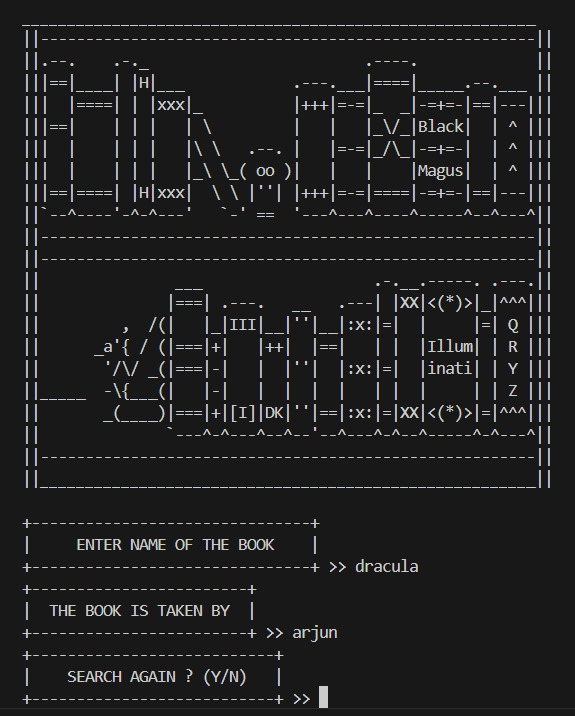

#  📘 ASCII Library Management

Welcome to the **ASCII Library Management and Organization Software**! This terminal-based tool helps you manage and organize your personal or small library with a simple and vibrant ASCII interface. The software combines nostalgia with functionality for cataloging, borrowing, and returning books.


# 💎 Features

- 📖 **Book Cataloging**: Add, update, and remove books easily.
- 🔍 **Search Functionality**: locate books by title and author.
- 📦 **Borrow/Return System**: Track borrowed books and manage returns.
- 📜 **Logs & History**: Keep a detailed record of all transactions.
- ✨ **Minimalistic Interface**: A distraction-free, colorful ASCII-based UI.
# 🔧 Modes

The software operates in two distinct modes:

1.**Customer Mode**:
   - **Access**: No password required for basic interactions.
   - **Functions**: Search for books, view catalog, and borrow/return books.
   - **Purpose**: For users who just want to interact with the library catalog and manage their borrowed books.

2.**Employee Mode**:
   - **Access**: Requires password to access.
   - **Password**: `amith`
   - **Functions**: Add, update, and remove books from the catalog; manage user accounts; view detailed logs and history.
   - **Purpose**: For library staff to manage and maintain the library's operations.   
# 💿 Installation

1.Clone the repository:
```bash
    git clone https://github.com/A-R-J-U/The-Librarian.git
```
2.Run the application:
```bash
    python main.py
```
# 📷 Preview

